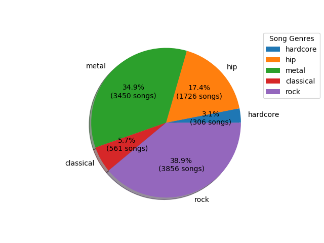
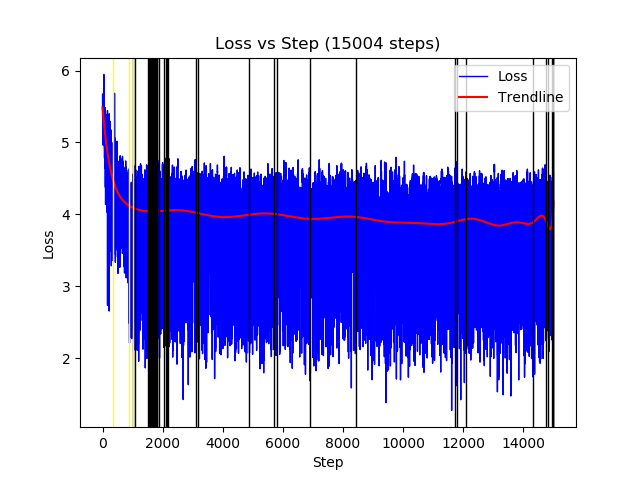
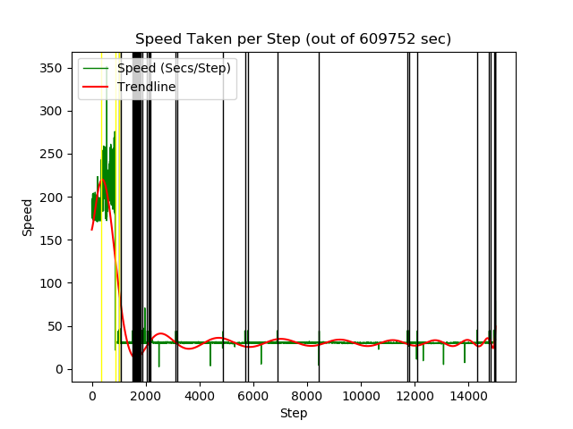

# Wave Net Exploration

## About

This is an open-source class project for the [Advanced Machine Learning course](http://courses.cs.vt.edu/cs5824/) under [Dr. Bert Huang](http://berthuang.com).
This project is intended for us (the developers) to reproduce a Machine Learning Paper's results in a new manner.

---

For our project we reproduce the paper [WaveNet](https://arxiv.org/pdf/1609.03499.pdf), with more resources listed below. The paper can also be found at the following website [here](https://deepmind.com/blog/article/wavenet-generative-model-raw-audio).

Other papers read through this project are listed below.

> PixelCNN [Paper](https://arxiv.org/pdf/1606.05328.pdf) [Website](https://deepmind.com/research/publications/conditional-image-generation-pixelcnn-decoders)
> PixelRNN [Paper](https://arxiv.org/pdf/1601.06759.pdf) [Website](https://deepmind.com/research/publications/pixel-recurrent-neural-networks)

## Procedure

For this project, we used a similar pattern used for machine learning projects.
1. Review and Research the paper
2. Understand or Implement the model
3. Prepare and format the data
4. Train the model
5. Run the model

---

### Understanding Wavenet

!!summary here!!

### Understanding the Model

Fortunately for us, this model had already been created several times.
To ensure we could spend most of the time for the project on training, we decided to use [ibab's](ttps://github.com/ibab/tensorflow-wavenet.git) implementation of the methodology.

> There were only two changes we implemented within the code, only to ensure project compatibility.
> > At line 274 in train.py, we modified the following to ensure we could save more checkpoints.
> > ```python3
> > -    saver = tf.train.Saver(... .max_checkpoints)
> > +    saver = tf.train.Saver(... .max_checkpoints, keep_checkpoint_every_n_hours=0.16)
> > ```
> 
> At line 68 of wavenet/audio_reader.py, we modified the following since the specific method was depricated.
> > ```python3
> > -    energy = librosa.feature.rmse(audio, frame_length=frame_length)
> > +    energy = librosa.feature.rms(audio, frame_length=frame_length)
> > ```


### Prepare and format the data

For the data preperation, the team used various music samples that were trimmed to fit a uniform format.
We choose the top 5 genres shared between us for the most amount of data.
Shown below is the distribution of collected of music samples.



For the library used, we had to use strict wav files without any meta-data.
For this we ran a script to automatically go through the music files, and if they had a genre and a year in their meta-data, we converted their first 30 seconds into a wav file format.

### Train the model

To train the model, we ran the library for roughly # days using the following command:
> python3 train.py --data_dir=~/Data/ --gc_channels=32 --checkpoint_every=1 --batch_size=2 1&>2 results.txt

Using anouther script to parse through the results.txt file, we were able to obtain the following statistics throughout the training process.

> Loss vs. Step



> Speed per Step



> As noted, there were several restart points where the training was migrated from machines to machine.
> The command only changed to add the addition of the restore from
> 

### Run the model

## Results

---

### Original Experiment Results
### Experiment Results
#### Model Training Statistics
#### Generated Samples

Basic Template sourced from: https://github.com/pages-themes/midnight


Text can be **bold**, _italic_, or ~~strikethrough~~.

[Link to another page](./another-page.html).

There should be whitespace between paragraphs.

There should be whitespace between paragraphs. We recommend including a README, or a file with information about your project.

# Header 1

This is a normal paragraph following a header. GitHub is a code hosting platform for version control and collaboration. It lets you and others work together on projects from anywhere.

## Header 2

> This is a blockquote following a header.
>
> When something is important enough, you do it even if the odds are not in your favor.

### Header 3

```js
// Javascript code with syntax highlighting.
var fun = function lang(l) {
  dateformat.i18n = require('./lang/' + l)
  return true;
}
```

```ruby
# Ruby code with syntax highlighting
GitHubPages::Dependencies.gems.each do |gem, version|
  s.add_dependency(gem, "= #{version}")
end
```

#### Header 4

*   This is an unordered list following a header.
*   This is an unordered list following a header.
*   This is an unordered list following a header.

##### Header 5

1.  This is an ordered list following a header.
2.  This is an ordered list following a header.
3.  This is an ordered list following a header.

###### Header 6

| head1        | head two          | three |
|:-------------|:------------------|:------|
| ok           | good swedish fish | nice  |
| out of stock | good and plenty   | nice  |
| ok           | good `oreos`      | hmm   |
| ok           | good `zoute` drop | yumm  |

### There's a horizontal rule below this.

* * *

### Here is an unordered list:

*   Item foo
*   Item bar
*   Item baz
*   Item zip

### And an ordered list:

1.  Item one
1.  Item two
1.  Item three
1.  Item four

### And a nested list:

- level 1 item
  - level 2 item
  - level 2 item
    - level 3 item
    - level 3 item
- level 1 item
  - level 2 item
  - level 2 item
  - level 2 item
- level 1 item
  - level 2 item
  - level 2 item
- level 1 item

### Small image


### Large image


### Definition lists can be used with HTML syntax.

<dl>
<dt>Name</dt>
<dd>Godzilla</dd>
<dt>Born</dt>
<dd>1952</dd>
<dt>Birthplace</dt>
<dd>Japan</dd>
<dt>Color</dt>
<dd>Green</dd>
</dl>

```
Long, single-line code blocks should not wrap. They should horizontally scroll if they are too long. This line should be long enough to demonstrate this.
```

```
The final element.
```
